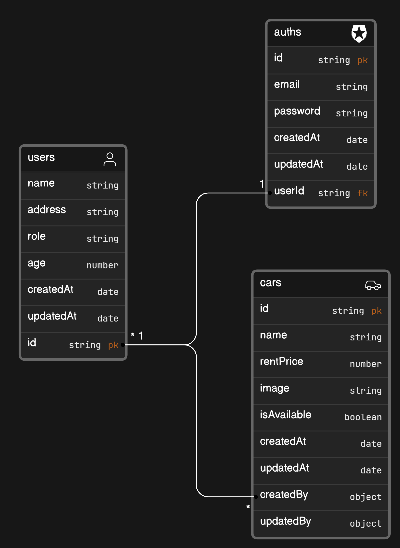

# Car Dashboard Management

## 📖 Database Diagram

<div align="center">



</div>

## 🛠 Tech Stack <a name="built-with"></a>

<details>
  <summary>Server</summary>
  <ul>
    <li> ExpressJS </li>
  </ul>
</details>

<details>
<summary>Database</summary>
  <ul>
    <li> MongoDB </li>
  </ul>
</details>

<details>
<summary>Authentication</summary>
  <ul>
    <li> Bcrypt </li>
    <li> JWT </li>
  </ul>
</details>

## How To Run Server

1. Clone File

```bash
git clone https://github.com/Hafieddz/F-FSW24001086-km6-haf-carDashboard-ch4.git
```

2. Install package dan run

```bash
# Install package
$ npm install
# Run Server
$ npm start
```

## Import / Delete Data

```bash
# Command Untuk Import Data ke Database
$ npm run import-data

# Command Untuk Delete Semua Data di Database
$ npm run delete-data
```

## Account Info

```bash
# Import data terlebih dahulu sebelum login
Akun Super Admin
{
  email : superadmin@mail.com,
  password : superadmin
}
Akun Admin
{
  email : admin@mail.com,
  password : admin
}
Akun Member
{
  email : member@mail.com,
  password : member
}
```

## API Routes

##### Auth : /api/v1/auths

##### User : /api/v1/users

##### Car : /api/v1/cars

## API Documentation

##### Route : /api_docs

API Docs File : [api-docs.json](./docs/api-docs.json)
